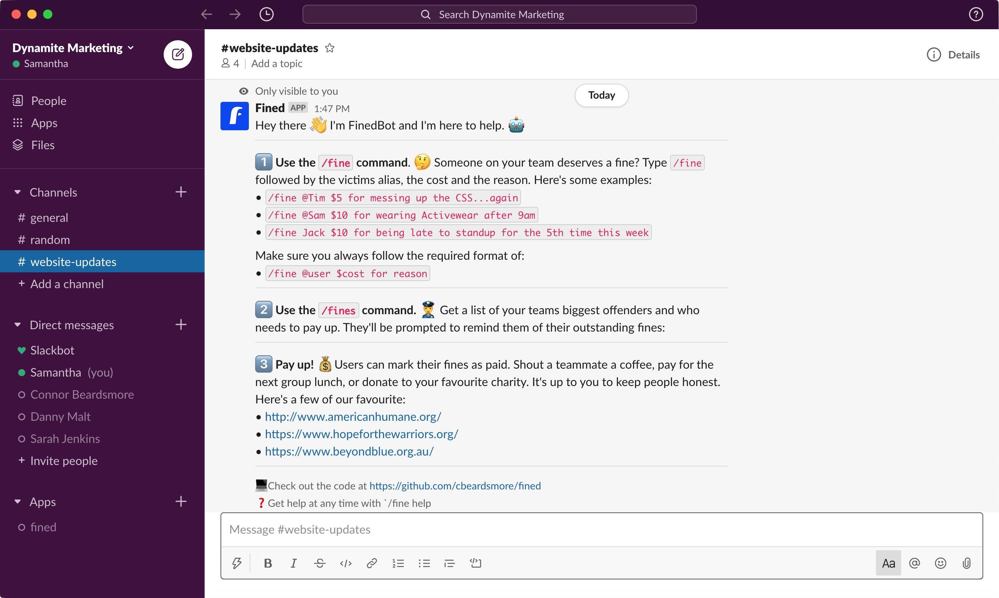

# fined

Slack Bot for managing Team Fines running on the Serverless framework

## Usage

- Fine a user:

    `/fine @user $amount for reason`
    
- List all channel fines:

    `/fines`
    
- Get help:

    `/fine help`

## Run Tests

- Install Dependencies:

    `pip3 install -r requirements.txt`

- Run Tests:
 
     `./test/test.sh`
     
## Serverless Framework

- Install Framework and Plugins:

    `npm install`

- To deploy:

    `serverless deploy`
