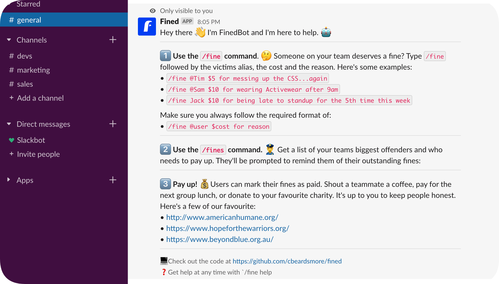

# fined

Slack Bot for managing Team Fines running on the Serverless framework

### Usage

- Fine a user:

    `/fine @user $amount for reason`
    
- List fines and their reasons:

    `/fines`
    
- Get help:

    `/fine help`

### Serverless Framework

- Install Framework and Plugins:

    `npm install`

- To deploy:

    `serverless deploy`

- Run lambda function locally with JSON event payload:

    `serverless invoke local --function fine --path local/fine.json -e SLACK_SIGNING_SECRET=fake_secret`

### Testing

- Install Dependencies:

    `pip3 install -r requirements.txt`

- Run Tests:
 
     `./test/test.sh`